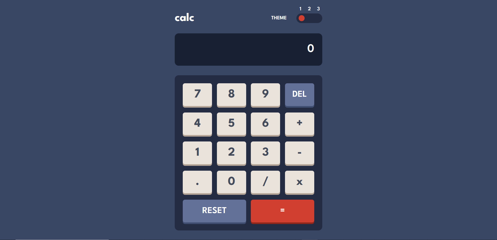

# Frontend Mentor - Calculator app solution

This is a solution to the [Calculator app challenge on Frontend Mentor](https://www.frontendmentor.io/challenges/calculator-app-9lteq5N29). Frontend Mentor challenges help you improve your coding skills by building realistic projects. 

## Table of contents

- [Overview](#overview)
  - [The challenge](#the-challenge)
  - [Screenshot](#screenshot)
  - [Links](#links)
- [My process](#my-process)
  - [Built with](#built-with)
- [Author](#author)
- [Acknowledgments](#acknowledgments)

## Overview

### The challenge

Users should be able to:

- See the size of the elements adjust based on their device's screen size
- Perform mathmatical operations like addition, subtraction, multiplication, and division
- Adjust the color theme based on their preference
- Have their initial theme preference checked using `prefers-color-scheme` and have any additional changes saved in the browser

### Screenshot

- Solution URL: [[Add solution URL here](https://github.com/Aabdalah/calculator-app)]
- Live Site URL: [[Add live site URL here](https://aabdalah.github.io/calculator-app/)]

## My process

### Built with

- HTML5 
- CSS custom properties
- Flexbox
- Mobile-first workflow
- [React](https://reactjs.org/) - JS library

## Author
- Frontend Mentor - [@Aabdalah](https://www.frontendmentor.io/profile/Aabdalah)

## Acknowledgments
- Odin project helped me a lot in figuring out the logic for this project -(https://www.theodinproject.com/lessons/foundations-calculator)

